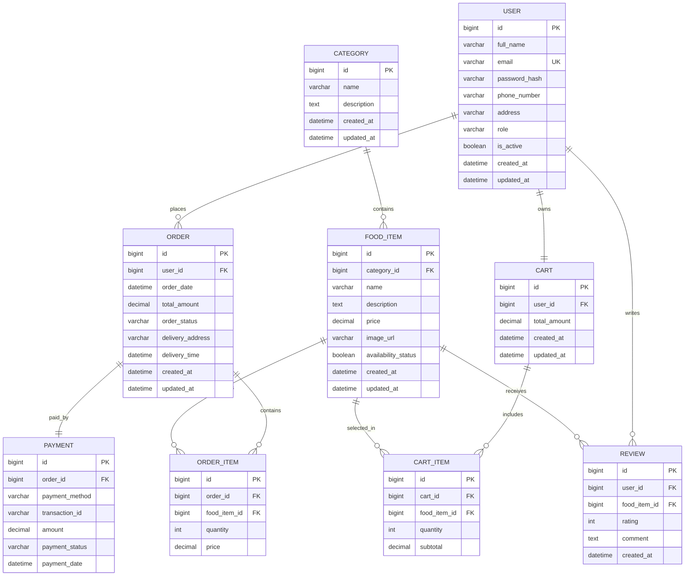

# Restaurant Food Ordering System - Entity Relationship Diagram (ERD)

> **Note:** This ERD is a **logical domain model** used for requirements analysis and technical design communication.
> The physical database implementation is documented in [21-database-design.md](21-database-design.md).

---

# Entity Overview

| Entity | Purpose |
|---|---|
| User | Stores customer and administrator account information |
| Category | Organizes food items into categories |
| FoodItem | Stores menu item information |
| Cart | Represents customer shopping carts |
| CartItem | Stores individual items inside carts |
| Order | Stores customer order information |
| OrderItem | Stores food items belonging to orders |
| Payment | Stores payment transaction details |
| Review | Stores customer ratings and feedback |

---

# Entity Attributes

## User

`id, full_name, email, password_hash, phone_number, address, role, is_active, created_at, updated_at`

---

## Category

`id, name, description, created_at, updated_at`

---

## FoodItem

`id, category_id, name, description, price, image_url, availability_status, created_at, updated_at`

---

## Cart

`id, user_id, total_amount, created_at, updated_at`

---

## CartItem

`id, cart_id, food_item_id, quantity, subtotal`

---

## Order

`id, user_id, order_date, total_amount, order_status, delivery_address, delivery_time, created_at, updated_at`

---

## OrderItem

`id, order_id, food_item_id, quantity, price`

---

## Payment

`id, order_id, payment_method, transaction_id, amount, payment_status, payment_date`

---

## Review

`id, user_id, food_item_id, rating, comment, created_at`

---

# Relationship Rules

1. One **User** can have many **Orders**.
2. One **User** can have one active **Cart**.
3. One **User** can submit many **Reviews**.
4. One **Category** can contain many **FoodItems**.
5. One **Cart** contains many **CartItems**.
6. One **FoodItem** can belong to many **CartItems**.
7. One **Order** contains many **OrderItems**.
8. One **FoodItem** can appear in many **OrderItems**.
9. One **Order** has one **Payment**.
10. One **FoodItem** can receive many **Reviews**.

---

# Mermaid ER Diagram

---

# Cardinality Summary

| Relationship | Cardinality |
|---|---|
| User → Order | One-to-Many |
| User → Review | One-to-Many |
| User → Cart | One-to-One |
| Category → FoodItem | One-to-Many |
| Cart → CartItem | One-to-Many |
| FoodItem → CartItem | One-to-Many |
| Order → OrderItem | One-to-Many |
| FoodItem → OrderItem | One-to-Many |
| Order → Payment | One-to-One |
| FoodItem → Review | One-to-Many |

---

# Business Rules

1. A customer must be registered before placing orders.
2. Each food item belongs to exactly one category.
3. A customer can place multiple orders.
4. Each order may contain multiple food items.
5. Payment information is associated with a single order.
6. Customers can provide reviews only for food items.
7. Food items marked unavailable cannot be added to the cart.
8. Order status can be one of:

- Pending
- Confirmed
- Preparing
- Out for Delivery
- Delivered
- Cancelled

---

# Related Documents

- [19-system-design.md](19-system-design.md)
- [20-tdd.md](20-tdd.md)
- [21-database-design.md](21-database-design.md)
- [22-api-design.md](22-api-design.md)
