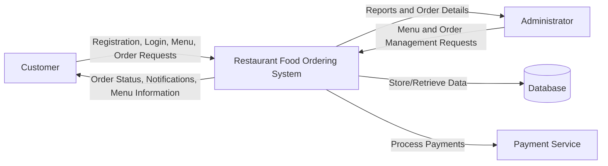
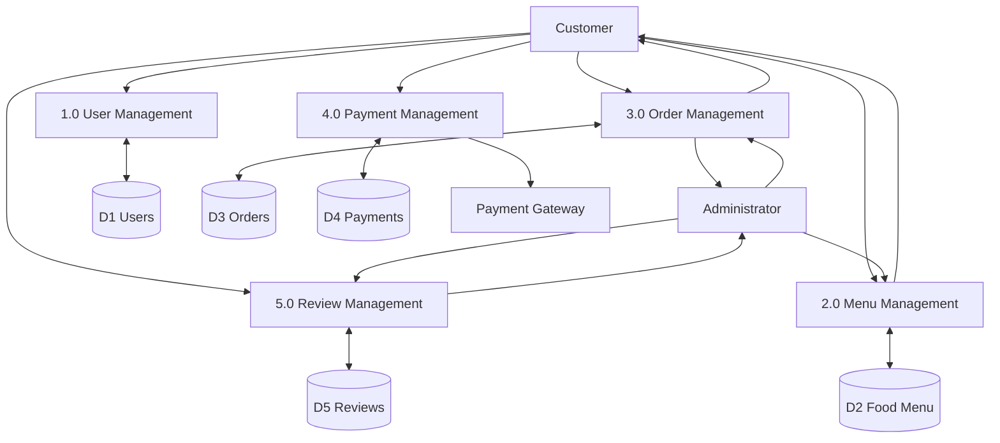

# Restaurant Food Ordering System - Data Flow Diagrams (DFD)

## Context Diagram

## Level 0 DFD

## Level 1 DFD - Process Decomposition

```mermaid
flowchart TD

  subgraph UM[1.0 User Management]
    UM1[1.1 Register User]
    UM2[1.2 Login User]
    UM3[1.3 Update Profile]
    UM4[1.4 Reset Password]
  end

  subgraph MM[2.0 Menu Management]
    MM1[2.1 View Menu]
    MM2[2.2 Search Food]
    MM3[2.3 Add Food Item]
    MM4[2.4 Update/Delete Food Item]
  end

  subgraph OM[3.0 Order Management]
    OM1[3.1 Add to Cart]
    OM2[3.2 Place Order]
    OM3[3.3 Track Order]
    OM4[3.4 View Order History]
    OM5[3.5 Update Order Status]
  end

  subgraph PM[4.0 Payment Management]
    PM1[4.1 Select Payment Method]
    PM2[4.2 Process Payment]
    PM3[4.3 Confirm Payment]
  end

  subgraph RM[5.0 Review Management]
    RM1[5.1 Submit Review]
    RM2[5.2 Manage Reviews]
  end

  DBU[(Users)]:::db
  DBM[(Food Menu)]:::db
  DBO[(Orders)]:::db
  DBP[(Payments)]:::db
  DBR[(Reviews)]:::db

  PG[Payment Gateway]

  UM1 --> DBU
  UM2 --> DBU
  UM3 --> DBU
  UM4 --> DBU

  MM1 --> DBM
  MM2 --> DBM
  MM3 --> DBM
  MM4 --> DBM

  OM1 --> DBO
  OM2 --> DBO
  OM3 --> DBO
  OM4 --> DBO
  OM5 --> DBO

  PM1 --> DBP
  PM2 --> PG
  PM3 --> DBP

  RM1 --> DBR
  RM2 --> DBR

  classDef db fill:#f2f2f2,stroke:#777,stroke-width:1px;
```

## Data Stores

| Data Store | Description |
|---|---|
| D1 Users | Stores customer and administrator account information |
| D2 Food Menu | Stores food categories and menu item details |
| D3 Orders | Stores customer orders and order status information |
| D4 Payments | Stores payment transaction records |
| D5 Reviews | Stores customer ratings and reviews |

## External Entities

| Entity | Description |
|---|---|
| Customer | Places orders and tracks delivery status |
| Administrator | Manages menu items, orders, and customer reviews |
| Payment Gateway | Processes online payment transactions |
