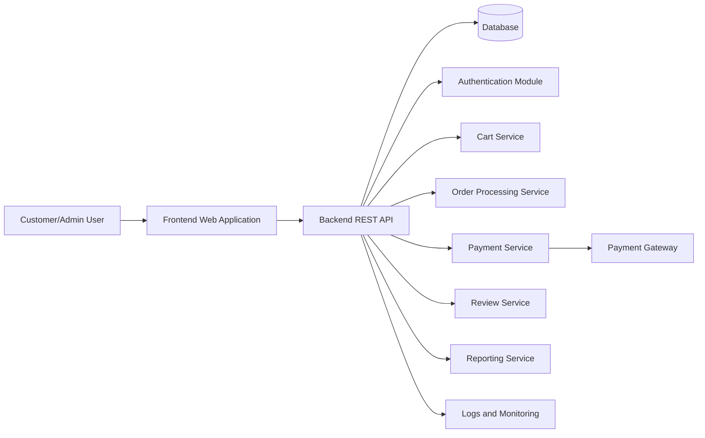
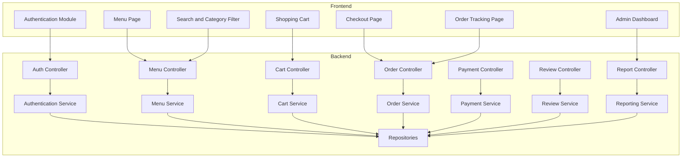
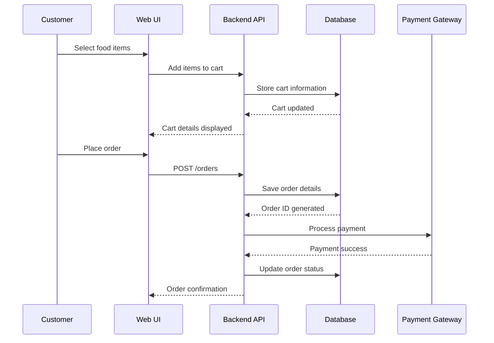
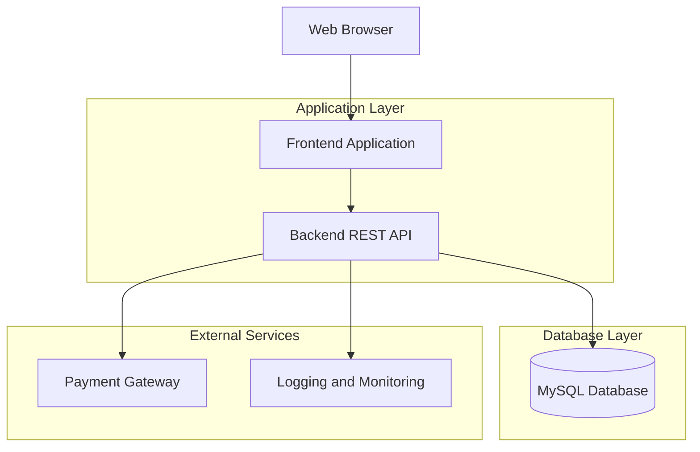

# Restaurant Food Ordering System - System Design

## High-Level Design

Restaurant Food Ordering System follows a layered, API-first architecture:

1. **Presentation Layer:** Web-based user interface for customers and administrators.
2. **Application Layer:** Backend services for authentication, menu management, cart management, order processing, payment handling, reviews, and reporting.
3. **Data Layer:** Relational database for persistent storage of users, food items, orders, payments, and reviews.
4. **Platform Layer:** Dockerized deployment environment with monitoring and logging support.

---

## Architecture Diagram

---

## Component Diagram

---

## Data Flow

---

## Security Architecture

| Layer | Control |
|---|---|
| Identity | User authentication and role-based authorization |
| API | Input validation and access control |
| Data | Encrypted communication and hashed passwords |
| Payment | Secure payment gateway integration |
| Audit | Logging of login activities and order transactions |
| Platform | Environment variables and restricted access permissions |

---

## Deployment Architecture

---

## Design Principles

1. **Modular Architecture**
   - Components are separated into frontend, backend, and database layers.

2. **Scalability**
   - Services can be extended to support multiple restaurants in future releases.

3. **Maintainability**
   - Business logic is separated from presentation and persistence layers.

4. **Security**
   - Authentication, authorization, and secure payment handling are enforced.

5. **Reliability**
   - Order and payment information are stored persistently to avoid data loss.

6. **Usability**
   - Customers can easily browse menus, place orders, and track deliveries.

---

## Technology Stack

| Layer | Technology |
|---|---|
| Frontend | HTML, CSS, JavaScript |
| Backend | Node.js / Express |
| Database | MySQL |
| Authentication | JWT |
| API Style | REST API |
| Payment Integration | Third-party Payment Gateway |
| Deployment | Docker |
| Monitoring | Logs and Metrics |
